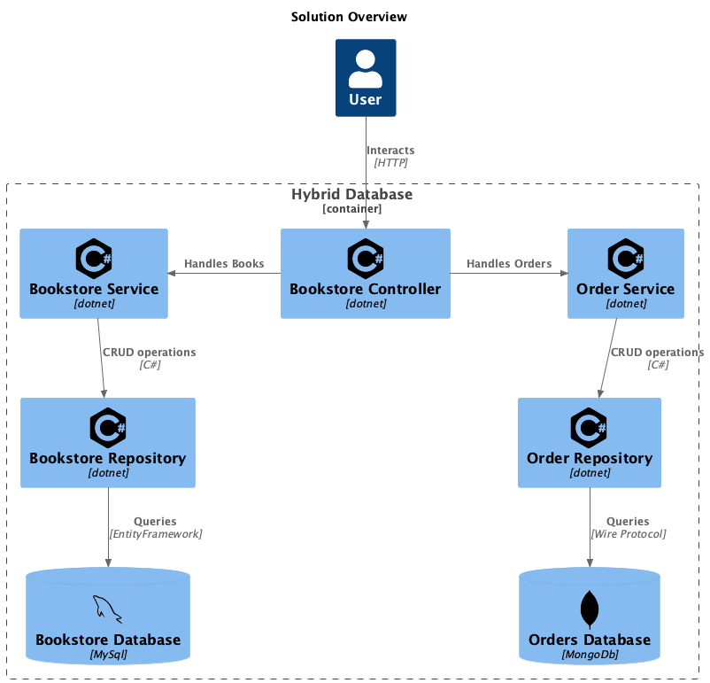

# Databases For Developers Synopsis

## This is an exam project showcasing a hybrid database

### How to read this
- At the same place as the present file, you will find a [Solution file](HybridDatabase.sln) that you can open in your IDE of choice. I made it in [Rider](https://www.jetbrains.com/rider/)
- If you are here for the synopsis, you can find it as [markdown](SYNOPSIS.md) or [PDF](synopsis.pdf)
- The solution relies on a REST api written in [ASP.NET](https://dotnet.microsoft.com/en-us/apps/aspnet/apis), so a lot of things are happening under the hood as part of the framework.

### Solution Overview

This is a visual description on how the project is glued together

